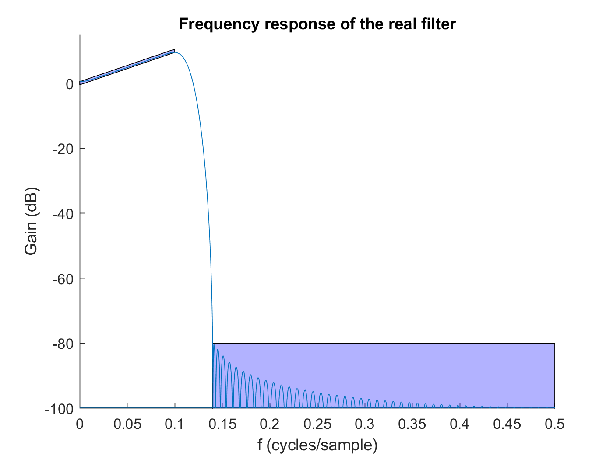

# Digital_Filter_design
1. Design **IIR filters** by iteratively hand-placing poles and zeros in the z-plane with the code in folder "[IIR_manually](IIR_manually/)".
2. Design **IIR filters** in a more efficient way by making use of Matlab's filter-design toolbox, using the code in folder "[IIR_design](IIR_design/)".
3. Design equirripple **FIR filters**, or design FIR filters using window methods, with the code in folder "[FIR_design](FIR_design/)".

An "[extra folder](analyse_samples/)" is included which analyses samples from a continuous signal. 

**Example**: FIR filter designed using a window method. 
